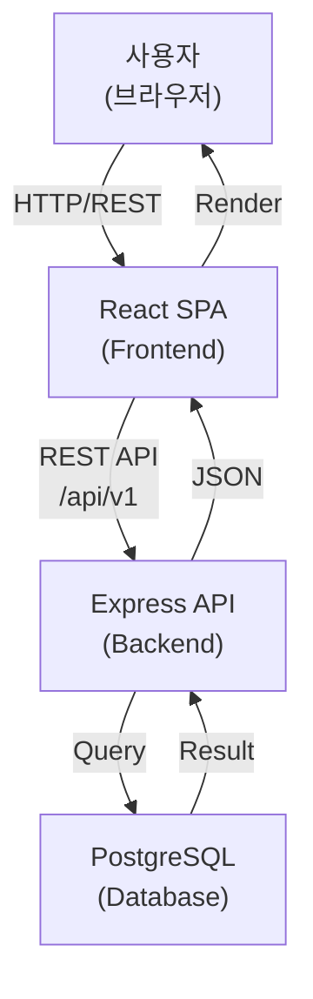
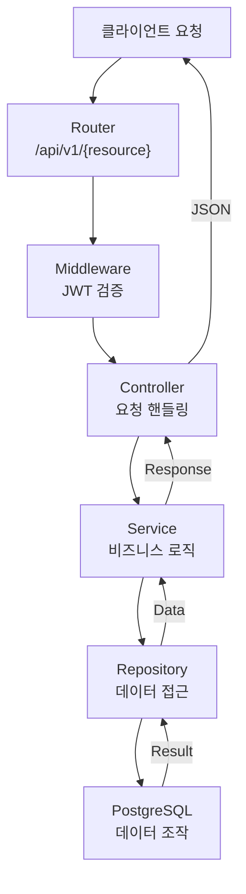
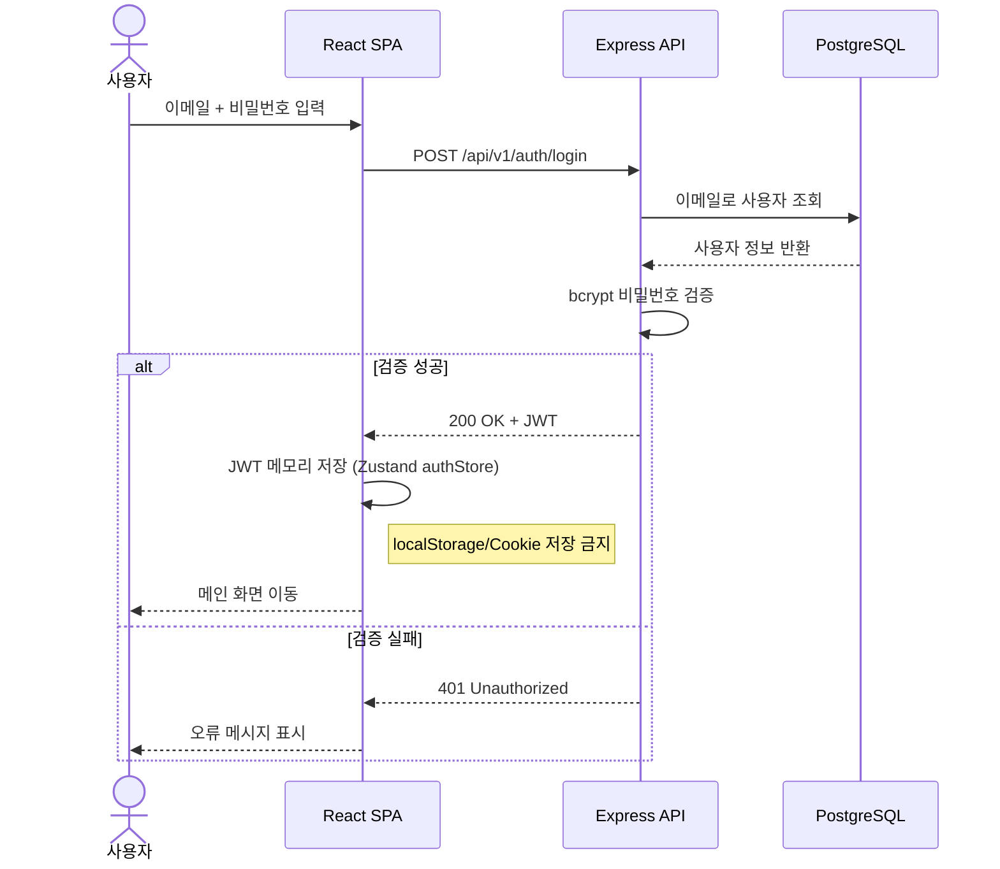
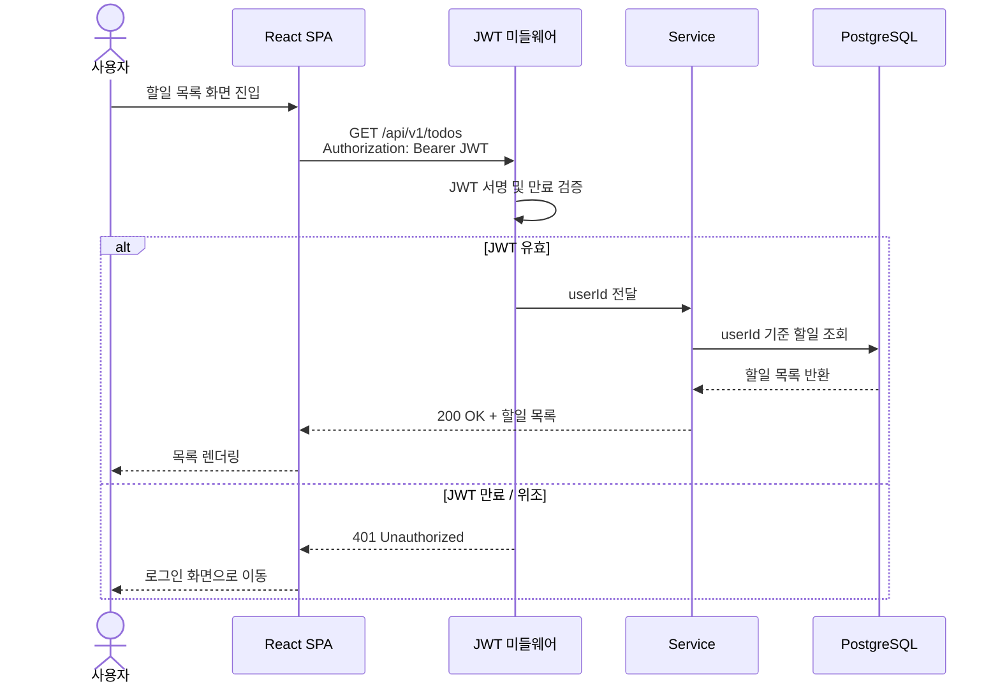
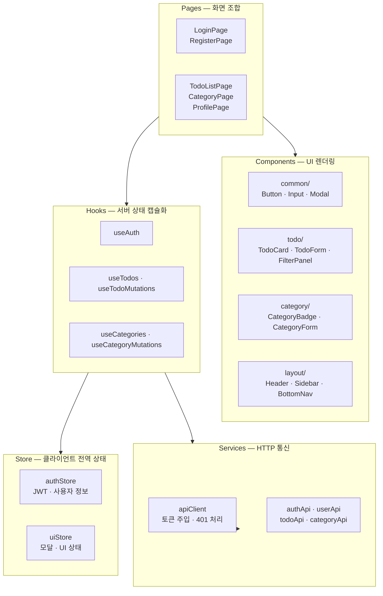
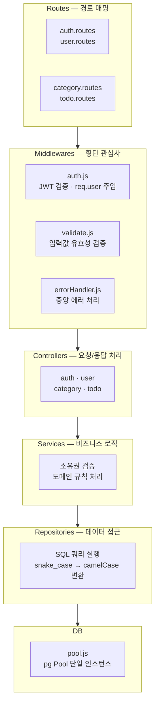

# 기술 아키텍처 다이어그램

**버전**: 1.0.0  
**작성일**: 2026-05-13  
**참조**: PRD v1.0.1

---

## 변경 이력

| 버전 | 작성일 | 내용 |
|------|--------|------|
| 1.0.0 | 2026-05-13 | 초기 작성 - 시스템 구조, 백엔드 레이어, 데이터베이스 ERD |

---

## 1. 시스템 전체 구조

사용자가 브라우저에서 React SPA에 접근하면, React는 Express API와 통신하여 PostgreSQL 데이터베이스의 데이터를 조작한다.

---

## 2. 백엔드 레이어 구조

클라이언트 요청은 Router에서 시작하여 JWT 미들웨어를 거쳐 Controller, Service, Repository 순으로 통과한 후 데이터베이스에 접근한다.

---

## 3. 데이터베이스 ERD

시스템은 3개의 핵심 엔티티로 구성된다. users는 todos와 categories의 상위 엔티티이며, categories는 사용자별 커스텀 카테고리와 기본 카테고리를 지원한다.

```mermaid
erDiagram
    USERS ||--o{ CATEGORIES : "1:N"
    USERS ||--o{ TODOS : "1:N"
    CATEGORIES ||--o{ TODOS : "1:N"
    
    USERS {
        uuid user_id PK
        string email
        string name
    }
    
    CATEGORIES {
        uuid category_id PK
        uuid user_id FK "NULL = 기본 카테고리"
        string name
        string color_code
        boolean is_default
    }
    
    TODOS {
        uuid todo_id PK
        uuid user_id FK
        uuid category_id FK
        string title
        date due_date
        boolean is_completed
    }
```

---

## 4. 요청 흐름도

### 4.1 인증 흐름 (로그인)

이메일과 비밀번호로 로그인하여 JWT를 발급받는 흐름이다.

---

### 4.2 인증된 API 요청 흐름 (할일 목록 조회)

JWT를 보유한 사용자가 인증이 필요한 API를 호출하는 흐름이다.

---

## 5. 컴포넌트 책임도

### 5.1 프론트엔드 컴포넌트 책임

각 레이어가 담당하는 책임의 흐름이다.

---

### 5.2 백엔드 컴포넌트 책임

각 컴포넌트의 단일 책임과 소유 영역이다.

