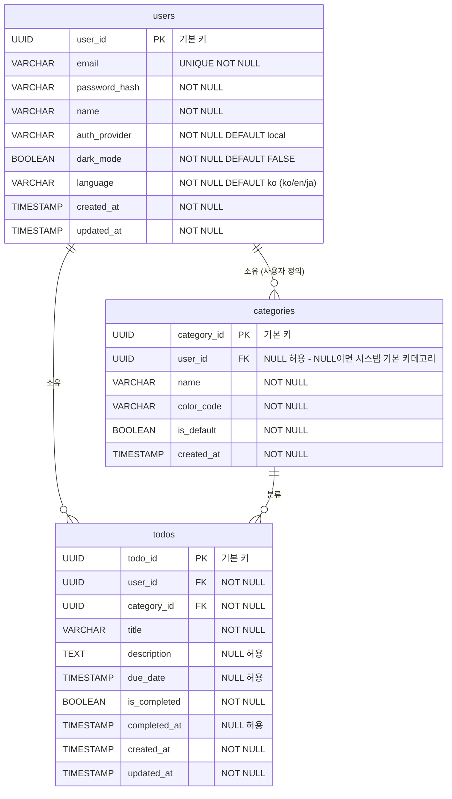

# ERD (Entity Relationship Diagram)

- 버전: 1.2.0
- 작성일: 2026-05-13
- 최종 수정: 2026-05-15
- 참조 PRD: v1.0.2

---

## 변경 이력

| 버전  | 날짜       | 작성자      | 내용                                           |
|-------|------------|-------------|------------------------------------------------|
| 1.0.0 | 2026-05-13 | -           | 최초 작성                                      |
| 1.1.0 | 2026-05-15 | joushukkeen | 다크 모드 영속화를 위한 `users.dark_mode` 컬럼 추가 |
| 1.2.0 | 2026-05-15 | joushukkeen | 다국어(ko/en/ja) 영속화를 위한 `users.language` 컬럼 + `chk_users_language` CHECK 제약 추가 |

---

## 1. ERD 다이어그램

---

## 2. 테이블 명세

### users

| 컬럼명        | 타입      | 제약조건        | 기본값  | 설명                                        |
|---------------|-----------|-----------------|---------|---------------------------------------------|
| user_id       | UUID      | PK, NOT NULL    | -       | 사용자 고유 식별자                          |
| email         | VARCHAR   | UNIQUE, NOT NULL | -      | 로그인 이메일 주소                          |
| password_hash | VARCHAR   | NOT NULL        | -       | 해시 처리된 비밀번호                        |
| name          | VARCHAR   | NOT NULL        | -       | 사용자 표시 이름                            |
| auth_provider | VARCHAR   | NOT NULL        | 'local' | 인증 제공자 식별자 (OAuth 확장 대비 예약)   |
| dark_mode     | BOOLEAN   | NOT NULL        | FALSE   | 사용자별 다크 모드 UI 설정                  |
| language      | VARCHAR(2) | NOT NULL, CHECK IN ('ko','en','ja') | 'ko' | 사용자별 UI 언어 (ISO 639-1)        |
| created_at    | TIMESTAMP | NOT NULL        | NOW()   | 계정 생성 일시                              |
| updated_at    | TIMESTAMP | NOT NULL        | NOW()   | 계정 마지막 수정 일시                       |

### categories

| 컬럼명      | 타입      | 제약조건              | 기본값 | 설명                                                      |
|-------------|-----------|-----------------------|--------|-----------------------------------------------------------|
| category_id | UUID      | PK, NOT NULL          | -      | 카테고리 고유 식별자                                      |
| user_id     | UUID      | FK(users), NULL 허용  | NULL   | 소유 사용자. NULL이면 시스템 기본 카테고리               |
| name        | VARCHAR   | NOT NULL              | -      | 카테고리 이름                                             |
| color_code  | VARCHAR   | NOT NULL              | -      | UI 표시용 색상 코드 (예: #FF5733)                        |
| is_default  | BOOLEAN   | NOT NULL              | FALSE  | 시스템 기본 카테고리 여부                                 |
| created_at  | TIMESTAMP | NOT NULL              | NOW()  | 카테고리 생성 일시                                        |

### todos

| 컬럼명       | 타입      | 제약조건              | 기본값 | 설명                              |
|--------------|-----------|-----------------------|--------|-----------------------------------|
| todo_id      | UUID      | PK, NOT NULL          | -      | 할일 고유 식별자                  |
| user_id      | UUID      | FK(users), NOT NULL   | -      | 할일 소유자                       |
| category_id  | UUID      | FK(categories), NOT NULL | -   | 할일이 속한 카테고리              |
| title        | VARCHAR   | NOT NULL              | -      | 할일 제목                         |
| description  | TEXT      | NULL 허용             | NULL   | 할일 상세 설명                    |
| due_date     | TIMESTAMP | NULL 허용             | NULL   | 마감 일시                         |
| is_completed | BOOLEAN   | NOT NULL              | FALSE  | 완료 여부                         |
| completed_at | TIMESTAMP | NULL 허용             | NULL   | 완료 처리 일시                    |
| created_at   | TIMESTAMP | NOT NULL              | NOW()  | 할일 생성 일시                    |
| updated_at   | TIMESTAMP | NOT NULL              | NOW()  | 할일 마지막 수정 일시             |

---

## 3. 관계 정의

| 부모 테이블 | 자식 테이블 | 관계          | 비고                                                        |
|-------------|-------------|---------------|-------------------------------------------------------------|
| users       | todos       | 1 : N         | 한 사용자는 여러 할일을 소유. todos.user_id 는 NOT NULL    |
| users       | categories  | 1 : N (선택적) | 한 사용자는 여러 사용자 정의 카테고리를 소유. categories.user_id 가 NULL이면 시스템 기본 카테고리 |
| categories  | todos       | 1 : N         | 한 카테고리는 여러 할일을 포함. todos.category_id 는 NOT NULL |

---

## 4. 설계 결정 사항

**UUID PK 선택 이유**
순차 정수(AUTO_INCREMENT) 대신 UUID를 기본 키로 사용하면 분산 환경에서 서버 간 충돌 없이 식별자를 생성할 수 있고, 외부 노출 시 레코드 수량 및 순서를 추측하기 어려워 보안성이 향상된다.

**`categories.user_id` NULL 허용 설계 이유**
시스템이 제공하는 기본 카테고리(개인, 업무, 쇼핑)는 특정 사용자에게 귀속되지 않으므로 `user_id`를 NULL로 허용하여 단일 테이블로 시스템 카테고리와 사용자 정의 카테고리를 통합 관리한다. `is_default` 플래그와 함께 사용하여 두 유형을 명확히 구분한다.

**`auth_provider` 컬럼 예약 이유**
현재는 이메일/비밀번호 기반 로컬 인증만 지원하지만, PRD §10 위험 대응 계획에 따라 Google, Kakao 등 OAuth v2 소셜 로그인 확장에 대비하여 컬럼을 미리 예약한다. 스키마 변경 없이 인증 제공자를 추가할 수 있어 마이그레이션 비용을 최소화한다.

**`dark_mode` 컬럼을 `users`에 둔 이유**
JWT를 메모리에만 보관하는 정책(PRD §4.3) 때문에 페이지 새로고침·재로그인 시 `localStorage` 등 클라이언트 영속화를 쓸 수 없다. 다크 모드는 사용자별 UI 선호이므로 서버 측 `users` 테이블에 보관하여, `GET /users/me` 응답과 `POST /auth/login` 응답에 `darkMode`를 함께 내려 재로그인 시 자동 복원되도록 한다. 향후 테마 색상 등 다른 사용자 설정이 늘어나면 별도 `user_preferences` 테이블로 분리한다.

**`language` 컬럼 설계 결정**
`dark_mode`와 동일한 이유로 사용자별 UI 언어 설정을 서버 `users.language`에 보관한다. 타입은 `VARCHAR(2)`로 ISO 639-1 두 글자 코드를 저장하고, `CHECK (language IN ('ko','en','ja'))` 제약으로 지원 언어만 허용한다. 향후 언어 확장 시 CHECK 제약만 갱신하면 되어 마이그레이션 비용이 낮다. `dark_mode`와 함께 `user_preferences` 분리 후보지만, 현재 두 컬럼 수준에서는 별도 테이블의 JOIN 비용이 더 크다.
