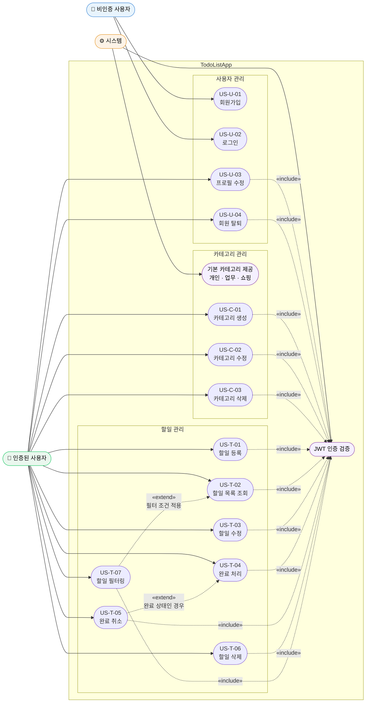

# TodoListApp Use Case Diagram

> 버전: 1.0.0
> 작성일: 2026-05-13
> 참조: [PRD v1.0.1](./2-prd.md)

---

## 액터 정의

| 액터 | 설명 |
|------|------|
| 비인증 사용자 | 회원가입 또는 로그인 전 상태의 접근자 |
| 인증된 사용자 | 로그인 후 JWT를 보유한 상태의 사용자 |
| 시스템 | 자동으로 처리되는 내부 동작 (기본 카테고리 제공, JWT 발급 등) |

---

## Use Case Diagram



---

## 관계 설명

### «include» — JWT 인증 검증

인증된 사용자가 수행하는 **모든 유스케이스**는 요청마다 JWT 유효성을 검증한다.
검증 실패(만료·위조) 시 `401 Unauthorized`를 반환하고 유스케이스를 중단한다.

### «extend» — 조건부 확장

| 기본 유스케이스 | 확장 유스케이스 | 확장 조건 |
|---|---|---|
| US-T-04 완료 처리 | US-T-05 완료 취소 | 해당 할일이 이미 완료 상태인 경우 |
| US-T-02 할일 목록 조회 | US-T-07 할일 필터링 | 카테고리·기간·완료 여부 필터 조건이 있는 경우 |

---

## 접근 제어 요약

```
비인증 사용자
  ├── 회원가입 (US-U-01)
  └── 로그인   (US-U-02)  →  JWT 발급

인증된 사용자  (JWT 필수)
  ├── 사용자 관리: 프로필 수정, 회원 탈퇴
  ├── 카테고리: 생성, 수정, 삭제  ← 기본 카테고리 수정·삭제 불가
  └── 할일: 등록, 조회, 수정, 완료, 완료취소, 삭제, 필터링
             └── 본인 소유 데이터만 접근 가능

시스템
  ├── 기본 카테고리 자동 제공 (개인·업무·쇼핑)
  └── JWT 발급 및 검증
```
